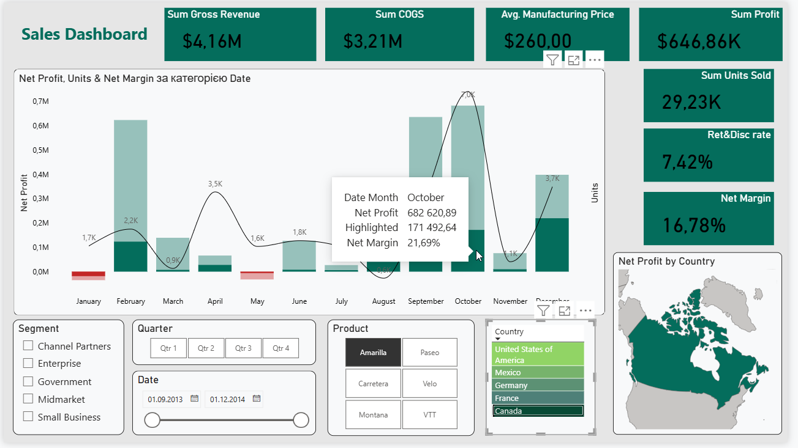

# Sales-analysis
Sales, P&L, and unit economics analysis based on the provided Power BI dataset

---

### Data Source and Methodology

The core analysis is built upon the **Sheet1** dataset, which serves as the foundation for all data models. To enhance data depth and business utility, the raw data was transformed using advanced Power BI capabilities and custom DAX measures, ensuring accurate financial calculations and an intuitive user experience.

---

### Dashboard Structure and Key Features

#### 1. Business Overview and Performance Tracking
The initial layers of the dashboard provide a high-level summary designed for executive decision-making. They offer an immediate understanding of the company's trajectory, overall health, and operational efficiency.

* 
* 

#### 2. Interactive P&L and Strategic Scenario Modeling ("What-If" Analysis)
This section introduces deep interactivity into the financial model. By enabling dynamic parameter adjustments, stakeholders can simulate various market scenarios, project future profitability, and build data-driven strategic plans for the business.

* 
* [Watch P&L Interaction Demonstration Video](screenshots/Interactive%20P&L%20vid.mp4)

#### 3. Unit Economics and Break-Even Analysis
The final component focuses strictly on Unit Economics. This page breaks down financial performance to the single-unit level and utilizes complex custom DAX metrics, such as Break-Even Point (BEP) in both cash and units. It provides clear visibility into the exact sales volumes required to cover fixed parameters and achieve profitability.

* 
* [Watch Unit Economics Demonstration Video](screenshots/Unit%20Economics%20vid.mp4)
